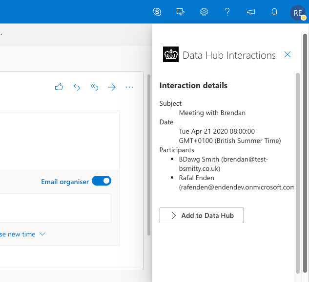

# Data Hub Office 365 Add-in

This is a POC of a Office 365 Add-in which was designed to speed-up creation of interactions from Outlook appointments.

## Starting the project locally

1. `npm i`
2. `npm run dev-server`
3. [Sideload the extension](https://docs.microsoft.com/en-gb/office/dev/add-ins/outlook/sideload-outlook-add-ins-for-testing)

[Full guide using Yeoman generator](https://docs.microsoft.com/en-gb/office/dev/add-ins/quickstarts/outlook-quickstart?tabs=yeomangenerator).
